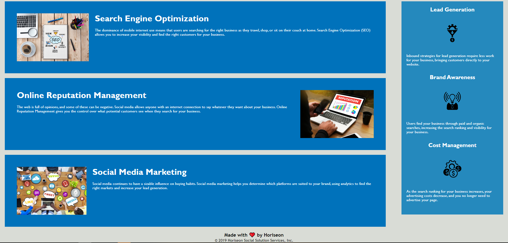

# Horiseon Code Refactor

## What is the purpose of this project? 

Web accessibility is essential for many businesses, and to make the existing webpage more accessible, I need to refactor the codes so my client's codebase will be more sustainable. However, the refactored codes should not affect the final layout of the webpage.

## How to achieve my goal?

I replaced several div with different grouping elements with comments, so people can find easily locate the content under a header, section, aside, and footer. I also updated the CSS stylesheet to remove and consolidate repetitive CSS classes. By placing comments above each grouping elements, other people will be able to quickly understand what information is included under each large section. By sorting the codes in a logical order will also help people access the codes they need by referencing the information on the existing webpage.

## Challenges

It was very tempting to **change** instead of **refactor** codes initially, so I needed to remind myself of the goal for this project periodically. I also had trouble making some correct connections between the CSS stylesheet and the HTML file.

## Credits

The initial codes are provided by Trilogy Education Services, a 2U, Inc. brand.

## License

© 2019 Horiseon Social Solution Services, Inc. All Rights Reserved. Under the [MIT/](./license.txt) license.
